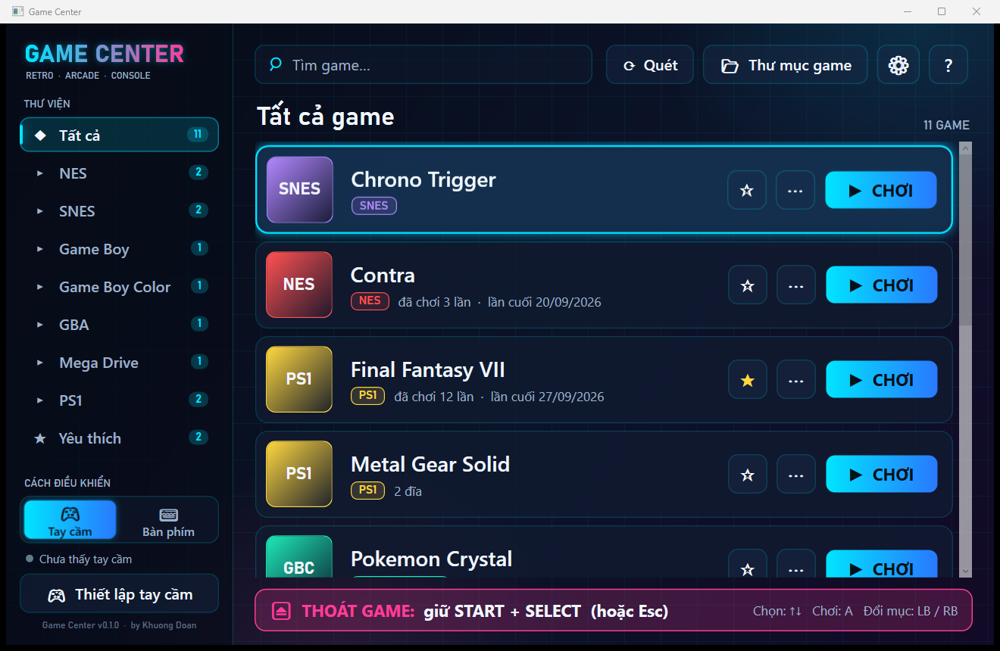
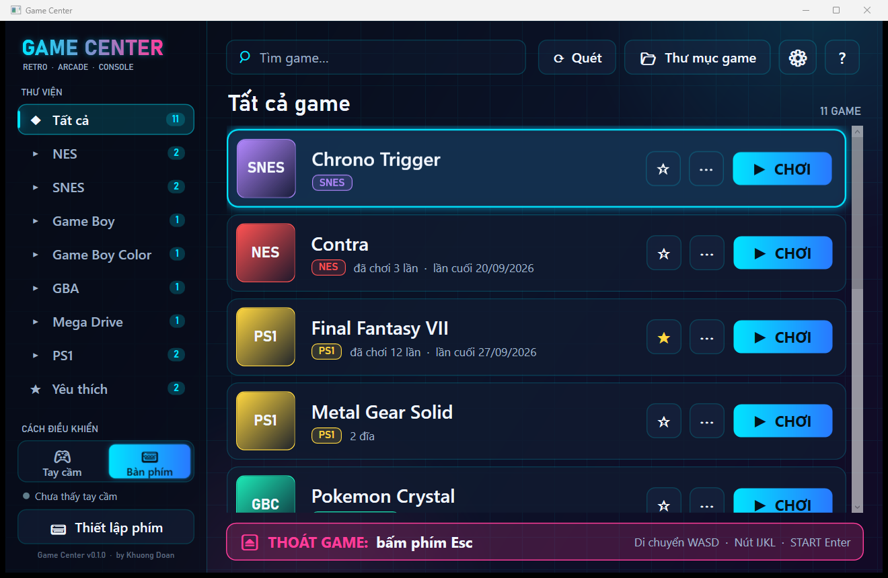
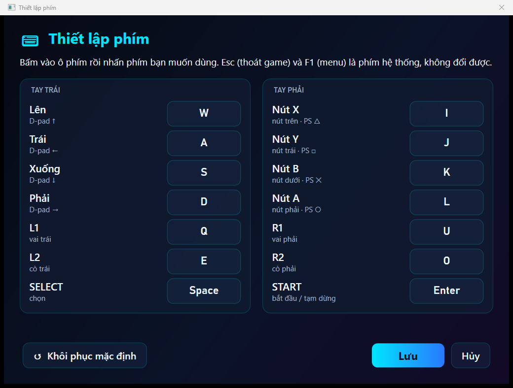

# Game Center

Launcher **miễn phí** cho game retro trên **Windows, macOS và Linux**, thiết kế cho người lớn tuổi: chữ lớn, nút to, điều khiển bằng tay cầm hoặc bàn phím. Mọi hệ máy chạy qua RetroArch.

```text
Cài đặt → Next → Finish → Chép game → Chơi
```



## Tải về

Tải ở mục [Releases](https://github.com/2ez4gcx/game-center/releases). Mọi bản đều đã kèm sẵn .NET 8, RetroArch và các core giả lập, không cần cài thêm gì. **Không kèm game hay BIOS.**

| Hệ điều hành | File | Cách cài |
|---|---|---|
| **Windows** 10/11 (64-bit) | `GameCenter-Setup-x.y.z.exe` | Chạy rồi bấm Next → Finish |
| **macOS** chip Apple (M1–M4) | `GameCenter-x.y.z-macos-arm64.dmg` | Mở file, kéo **Game Center** vào **Applications** |
| **macOS** chip Intel | `GameCenter-x.y.z-macos-x86_64.dmg` | Như trên |
| **Linux** (64-bit) | `GameCenter-x.y.z-x86_64.AppImage` | Cho phép chạy (`chmod +x`) rồi nhấp đúp |

**Windows:** không cần quyền admin, mặc định cài vào `C:\GameCenter` (có thể chọn ổ khác). Game, save, BIOS nằm ngay trong thư mục cài đặt. Gỡ cài đặt **không xóa** game và save.

**macOS / Linux:** game, save, BIOS nằm ở thư mục `GameCenter` trong thư mục người dùng (`~/GameCenter`). Trên macOS, lần đầu mở hãy **chuột phải → Mở** vì app chưa được Apple công chứng.

## Hệ máy hỗ trợ

| Hệ máy | Định dạng | Core | Giấy phép core |
|---|---|---|---|
| NES | `.nes`, `.zip` | FCEUmm | GPLv2 |
| SNES | `.sfc`, `.smc`, `.zip` | Snes9x | Phi thương mại |
| Game Boy / Color | `.gb`, `.gbc`, `.zip` | Gambatte | GPLv2 |
| GBA | `.gba`, `.zip` | mGBA | MPL 2.0 |
| Mega Drive | `.md`, `.gen`, `.bin`, `.zip` | Genesis Plus GX | Phi thương mại |
| PS1 | `.cue`, `.bin`, `.pbp`, `.chd`, `.m3u` | Beetle PSX HW | GPLv2 |

PS1 chơi được ngay không cần BIOS (OpenBIOS). Thêm BIOS bạn tự sao lưu vào thư mục `BIOS\` để tương thích tốt hơn.

## Game Center khác RetroArch thế nào?

Game Center **không thay thế** RetroArch mà là lớp giao diện đơn giản đặt phía trên. Phần chạy game vẫn do RetroArch và các core của nó làm; Game Center lo mọi việc còn lại để người dùng không phải đụng tới RetroArch.

| | RetroArch dùng một mình | Game Center |
|---|---|---|
| **Vai trò** | Trình giả lập đa hệ máy, chạy game | Launcher: quản lý game, gọi RetroArch để chơi |
| **Cài đặt** | Tự tải từng core, tự cấu hình thư mục, BIOS, tay cầm | Bộ cài có sẵn RetroArch, 6 core và cấu hình |
| **Thêm game** | Tự quét hoặc tạo playlist trong menu, phải chọn đúng core | Chép vào `Games`, tự nhận hệ máy và tự hiện lên |
| **PS1** | Tự xử lý `.cue`, tự viết `.m3u` cho game nhiều đĩa | Tự ghép đĩa, tự tạo `.cue` cho `.bin` lẻ, tự tạo `.m3u` |
| **Giao diện** | Menu nhiều tầng, chữ nhỏ, hàng trăm tùy chọn | Một màn hình, chữ lớn, nút "Chơi" |
| **Điều khiển** | Phải tự gán phím, phím tắt mặc định dễ bấm nhầm (tua nhanh, tạm dừng…) | Phím WASD/IJKL có sẵn, đã tắt các phím tắt dễ nhầm, gán lại bằng cửa sổ đơn giản |
| **Thoát game** | Phải biết tổ hợp phím hoặc vào menu | Luôn hiện hướng dẫn trên màn hình; phải bấm 2 lần mới thoát để tránh lỡ tay |
| **Save state** | Lưu/nạp thủ công, hoặc tự động ngầm | Hỏi khi thoát và khi mở lại, bằng câu dễ hiểu |
| **Tiện ích** | Có nhưng nằm sâu trong menu | Yêu thích, chơi gần đây, tìm kiếm không dấu, sao lưu save |

Nói ngắn gọn: **RetroArch** là "cỗ máy" chạy game, mạnh và linh hoạt nhưng dành cho người rành công nghệ. **Game Center** là "vỏ bọc" dễ dùng: chép game, bấm Chơi, không cần biết emulator là gì. Người rành công nghệ vẫn có thể mở RetroArch trong thư mục cài đặt (`Emulators\RetroArch\retroarch.exe`) để chỉnh sâu hơn.

## Sử dụng

**Thêm game:** chép vào thư mục `Games\`, để chung một chỗ cũng được. Game Center tự nhận ra hệ máy theo nội dung file và tự hiện game mới sau vài giây.

- `.cue` + `.bin` PS1 hiện một lần; game nhiều đĩa tự ghép và đổi đĩa được khi đang chơi.
- `.bin` không có `.cue`: nhận đĩa PS1 hoặc ROM Mega Drive theo nội dung.
- `.zip` nhiều ROM: mỗi ROM thành một game.
- File không nhận ra được nằm ở mục **Chưa nhận ra**, bấm để chọn hệ máy.

**Điều khiển:** chọn **Tay cầm** hoặc **Bàn phím** ở góc trái; bàn phím luôn dùng được song song với tay cầm.

| Tay cầm | Bàn phím (mặc định) |
|---|---|
| D-pad ↑ ← ↓ → | W A S D |
| X / Y / B / A | I / J / K / L |
| L1 / L2 | Q / E |
| R1 / R2 | U / O |
| START / SELECT | Enter / Space |

Đổi phím: **Thiết lập phím** (bấm vào ô rồi nhấn phím mới).

| Chế độ bàn phím | Thiết lập phím |
|---|---|
|  |  |

**Thoát game:** bấm **START + SELECT** trên tay cầm, hoặc **Esc** trên bàn phím, **2 lần liên tiếp**. Lần đầu chỉ hiện "Nhấn lại để thoát...", để lỡ chạm một lần không mất game đang chơi. **F1** mở menu giả lập (đổi đĩa…), **F2 / F4** lưu / tải nhanh. Menu và thông báo của giả lập hiển thị bằng tiếng Việt.

**Save game:**
- Save trong game (memory card, save trong băng) luôn được giữ, tự ghi xuống ổ mỗi 10 giây.
- Khi thoát, Game Center hỏi có **lưu lại chỗ đang chơi** không; lần mở sau hỏi **chơi tiếp** hay **chơi từ đầu**. Tắt được trong Cài đặt.
- **Cài đặt → Sao lưu dữ liệu** nén toàn bộ save thành file zip có ngày.

**Dùng save thẻ nhớ PS1 có sẵn** (từ giả lập khác hoặc tải về):

1. Tắt game đang chơi (RetroArch chỉ đọc thẻ nhớ lúc mở game).
2. **Cài đặt → Mở thư mục save**, vào thư mục **`Beetle PSX HW`**:
   - Windows: `<thư mục cài>\Saves\Beetle PSX HW\` (mặc định `C:\GameCenter\Saves\Beetle PSX HW\`)
   - macOS / Linux: `~/GameCenter/Saves/Beetle PSX HW/`
3. Nếu đã có file `.srm` cùng tên, chép ra chỗ khác để sao lưu.
4. Chép file thẻ nhớ vào và **đổi tên thành đúng tên file game** (tên file gốc, kể cả "(USA)"), đuôi `.srm`:

   | Game chạy từ | Tên file save |
   |---|---|
   | `Yu-Gi-Oh! Forbidden Memories (USA).bin` hoặc `.cue` | `Yu-Gi-Oh! Forbidden Memories (USA).srm` |
   | Nhiều đĩa: `Metal Gear Solid (Disc 1).cue`, `(Disc 2).cue` | `Metal Gear Solid.srm` (dùng chung mọi đĩa) |
   | `.chd` / `.pbp` | tên file đó + `.srm` |

5. Mở game, vào màn hình Load: save nằm ở Memory Card 1.

| Định dạng thẻ nhớ | Từ đâu | Cách dùng |
|---|---|---|
| `.mcr`, `.mcd`, `.mc`, `.srm` (đúng 128 KB) | ePSXe, DuckStation, PCSX, RetroArch | Chỉ cần đổi tên thành `.srm` |
| `.gme` | DexDrive | Chuyển đổi trước bằng [MemcardRex](https://github.com/ShendoXT/memcardrex) |
| `.psv`, `.mcs`, `.psx` | PS3, save lẻ từng game | Dùng MemcardRex chép vào thẻ nhớ trống, lưu thành `.mcr`, rồi đổi tên |

File dùng được ngay phải nặng đúng **131.072 byte (128 KB)**.

**Điều khiển launcher bằng tay cầm:** ↑↓ chọn game, A chơi, LB/RB đổi mục, Y yêu thích, X thêm tùy chọn, START cài đặt, SELECT trợ giúp.

## Phát triển

Cần .NET 8 SDK.

```
dotnet test
dotnet run --project src/GameCenter.Desktop
```

Chạy với thư mục dữ liệu riêng khi kiểm thử: đặt biến môi trường `GAMECENTER_DATA_DIR`.

| Thư mục | Nội dung |
|---|---|
| `src/GameCenter.Core` | Quét và nhận diện game, SQLite, sinh `retroarch.cfg`, sơ đồ phím, save state, khởi chạy RetroArch |
| `src/GameCenter.Desktop` | Giao diện Avalonia (Windows / macOS / Linux), đọc tay cầm bằng SDL2 |
| `tests/GameCenter.Tests` | Kiểm thử |
| `Defaults/` | `platforms.json` (core từng hệ máy), `retroarch-base.cfg` |
| `Licenses/` | Giấy phép Game Center, RetroArch và từng core |
| `installer/` | Bộ cài Windows (Inno Setup) |
| `tools/package-linux.sh`, `tools/package-macos.sh` | Đóng gói AppImage (Linux) và .dmg (macOS) |
| `.github/workflows/release.yml` | Kiểm thử trên 3 hệ điều hành; push tag `v*` thì tự đóng gói và tạo bản nháp Release |
| `tools/fetch-retroarch.ps1` | Tải RetroArch, core và LICENSE vào thư mục publish |

Phát hành:

```
./build.ps1                                                   # test + publish self-contained (kèm .NET 8)
./tools/fetch-retroarch.ps1 -Version 1.22.2                   # RetroArch + core + LICENSE
& "C:\Program Files\Inno Setup 7\ISCC.exe" installer\GameCenter.iss
```

Linux / macOS (chạy trên chính hệ đó, hoặc để GitHub Actions build khi push tag):

```
bash tools/package-linux.sh 1.22.2
bash tools/package-macos.sh arm64 1.22.2      # hoặc x86_64
```

Thiết kế chi tiết: [GAME_CENTER_IMPLEMENTATION.md](GAME_CENTER_IMPLEMENTATION.md).

## Giấy phép

Game Center miễn phí, không quảng cáo, không tính năng trả phí. RetroArch và các core giữ giấy phép riêng (xem `Licenses/`). Snes9x và Genesis Plus GX chỉ cho phép phân phối phi thương mại. Game Center không phải sản phẩm chính thức của Sony, Nintendo hay Sega.

---

Phát triển bởi **Khuong Doan**: <https://khuongdoan.com/>

<sub>Game Center miễn phí và sẽ luôn như vậy. Nếu nó giúp bạn chơi lại trò chơi tuổi thơ và bạn muốn mời tác giả một ly cà phê, quét mã MoMo bên dưới. Không bắt buộc, không kèm quyền lợi gì thêm. Khoản ủng hộ dành cho phần launcher Game Center, không phải cho các trình giả lập đi kèm.</sub>

<a href="https://github.com/2ez4gcx/Project-hub/blob/main/docs/anh/ung-ho-momo.png"></a>
